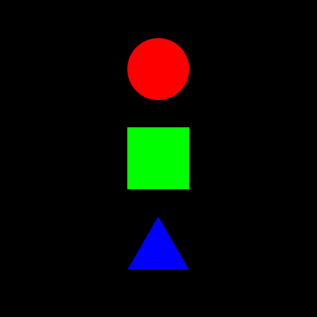
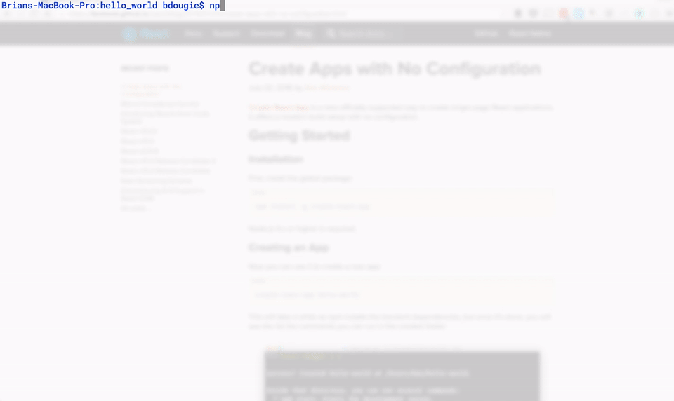

# **Celo Development 102**


## Building the Frontend of the DApp

In this chapter, you will learn how to build the user interface of your NFT minter, connect it to your smart contract and host it on GitHub.


### **Learning Objective**

After completing this chapter, you will:


* Understand how to use React to build the frontend of your Dapp
* Understand React hooks and how to use them.
* Connect your DApp to your smart contract on the Celo blockchain with the library celo-tools.
* Learn how to mint NFTs.

**Prerequisites**

Tools you will need for this project include


* Any code editor (VS Code Recommended)
* [Node JS](https://nodejs.org/en/download/)
* [Npm/Yarn](https://docs.npmjs.com/downloading-and-installing-node-js-and-npm)
* [React](https://reactjs.org/docs/getting-started.html)

**1.0. Initializing your project**

**	**

Firstly, you need to initialize a new React project. We would do that using the famous ‘create-react app’. You should have installed node.js 10 or higher.


1. Open your command-line interface
2. Install ‘create-react-app’ inside your directory of choice via your terminal using the command below:

    	 ​​npm install create-react-app

3. Initialize the project using the following command:

         ​​npx create-react-app nft-minter

4. Navigate into the project:

        cd nft-minter
       


5. Install the required dependencies with the command:


```
npm install react-bootstrap bootstrap-icons bootstrap big-number axios ipfs-http-client prop-types react-toastify @metamask/jazzicon
```


6. Start a local development server:
​​`npm start`


	Your project should be running here http://localhost:3000/

### 2.0. Building the User Interface 

#### 2.1. Let us do a little cleanup first.


Navigate to the ‘public/index.html’ page and change the title and meta description of your website to your preferred texts. This step is optional.

Secondly, Open the src folder and delete the ‘App.test.js’, and ‘setupTests.js’ files. We will not be needing these files for this tutorial.

Next up, Navigate to the App.js file and replace its contents with the following boilerplate:


```
Import "./App.css";
const App = function AppWrapper() {

return (
<h1>Hello World</h1>
)
}

export default App
```


Remove all the contents of 'App.css' as well and replace it with the following code:


```
.cover {
 background-image: radial-gradient( circle farthest-corner at 10% 20%,
 #35D07F 0%, #2aa666 47.7%, #207d4c 92.3% );
 border-radius: .5em;
}
.vh-80 {
 height: 80vh!important;
}
```


Finally, replace the index.css file with the following code:


```
body {
 margin: 0;
 font-family: -apple-system, BlinkMacSystemFont, 'Segoe UI', 'Roboto', 'Oxygen',
   'Ubuntu', 'Cantarell', 'Fira Sans', 'Droid Sans', 'Helvetica Neue',
   sans-serif;
 -webkit-font-smoothing: antialiased;
 -moz-osx-font-smoothing: grayscale;
}

code {
 font-family: source-code-pro, Menlo, Monaco, Consolas, 'Courier New',
   monospace;
}
```


Next, we add a cover image. Create a folder called _‘assets'_ under the _'src'_ folder , _‘src/assets’ then proceed by creating a folder inside of the ‘assets’ folder created called ‘img’ and then paste the ‘nft_geo_cover.png’ image file._





Fig 2.1

This will serve as a cover page for the DApp when the user is not connected to Metamask.

Finally, let us create a component to display this page.

To do that, create a folder called _components_, like so _‘src/components’_  then create a file called _‘Cover.js’_. 

We go ahead and import the necessary libraries for this component in the newly created _‘Cover.js’_ file:


```
import React from 'react';
import { Button } from "react-bootstrap";
import PropTypes from 'prop-types';
```


Next, paste the following code below in the Cover.js file after importing the libraries needed:


```
const Cover = ({ name, coverImg, connect }) => {
 if (name) {
   return (
     <div
         className="d-flex justify-content-center flex-column text-center "
         style={{ background: "#000", minHeight: "100vh" }}
       >
         <div className="mt-auto text-light mb-5">
           <div
             className=" ratio ratio-1x1 mx-auto mb-2"
             style={{ maxWidth: "320px" }}
           >
             
           </div>
           <h1>{name}</h1>
           <p>Please connect your wallet to continue.</p>
           <Button
             onClick={() => connect().catch((e) => console.log(e))}
             variant="outline-light"
             className="rounded-pill px-3 mt-3"
           >
             Connect Wallet
           </Button>
         </div>

         <p className="mt-auto text-secondary">Powered by Celo</p>
       </div>
   );
 }

 return null;
};
```


We are expecting three variables via props (name, coverImge, and connect):

Name: which is the name of the Dapp,

CoverImg : as you guessed, the cover image used in this DApp,

Connect: which is a function that prompts the user to connect his wallet to the DApp and is exported from Celo useContractKit which we will explore later on in this tutorial.

In case you don't know what props are read [here](https://reactjs.org/docs/components-and-props.html). React allows us to pass data down into other components using something we call props which is short for properties.

Above we check if the name prop exists  and if it does, we render the component.

We then create an onClick handler on the connect wallet button to trigger the connect function when clicked.

Finally, let us go ahead and declare our proptypes.


```
Cover.propTypes = {
 // props passed into this component
 name: PropTypes.string,
};

Cover.defaultProps = {
 name: '',
};

export default Cover;
```


In case you don't know what propTypes are, PropTypes are **a mechanism to ensure that components use the correct data type and pass the right data**, that components use the right type of props, and that receiving components receive the right type of props. [Click to know more](https://reactjs.org/docs/typechecking-with-proptypes.html).

**2.2. UI Components**

Lets go ahead and create UI components we will be using throughout our DApp.

**2.2.1. Notification Library**

In order to show users updates on functions happening under the hood in the Dapp, we need to display notifications. In this example we will be using _react-toastify _ which you must have installed earlier.

Firstly you create the folders _'components/ui'_ under the src folder.

Inside the _'ui'_ folder , create a file called _'Notifications.js'_ and paste the following code

```
import React from 'react';
import PropTypes from 'prop-types';
import {ToastContainer} from 'react-toastify';

const Notification = () => (
 <ToastContainer
   position="bottom-center"
   autoClose={5000}
   hideProgressBar
   newestOnTop
   closeOnClick
   rtl={false}
   pauseOnFocusLoss
   draggable={false}
   pauseOnHover
 />
);

const NotificationSuccess = ({ text }) => (
 <div>
   <i className="bi bi-check-circle-fill text-success mx-2" />
   <span className="text-secondary mx-1">{text}</span>
 </div>
);

const NotificationError = ({ text }) => (
 <div>
   <i className="bi bi-x-circle-fill text-danger mx-2" />
   <span className="text-secondary mx-1">{text}</span>
 </div>
);

const Props = {
 text: PropTypes.string,
};

const DefaultProps = {
 text: '',
};

NotificationSuccess.propTypes = Props;
NotificationSuccess.defaultProps = DefaultProps;

NotificationError.propTypes = Props;
NotificationError.defaultProps = DefaultProps;

export { Notification, NotificationSuccess, NotificationError };
```


**2.2.2. Loading Component**

Under the _'components/ui'_ path, create a new file called _'Loader.js'_ and paste in the code below.


```
import React from 'react';
import { Spinner} from "react-bootstrap";
const Loader = () => (


 <div className="d-flex justify-content-center">
   <Spinner animation="border" role="status" className="opacity-25">
     <span className="visually-hidden">Loading...</span>
   </Spinner>
 </div>

);
export default Loader;
```


We are using the Spinner component from [_react-bootstrap._](https://react-bootstrap.github.io/)

**2.2.3. Identicons**

An Identicon is a visual representation of a hash value, usually of an address, that serves to identify an address as a form of avatar.

Under the _'components/ui'_ path, create a new file called _'Identicon.js'_ and paste in the code below.


```
import { useEffect, useRef } from "react";
import Jazzicon from "@metamask/jazzicon";

export default function Identicon({address, size, ...rest}) {
 const ref = useRef();

 useEffect(() => {
   if (address && ref.current) {
     ref.current.innerHTML = "";
     ref.current.appendChild(Jazzicon(size, parseInt(address.slice(2, 10), 16)));
   }
 }, [address, size]);

 return (
   <div {...rest} >
       <div ref={ref} style={{width:`${size}px`,height:`${size}px`}}  />
   </div>
 )
}
```


We basically shorten the user address and pass it into the Jazzicon to create an identicon. We then put that into a useEffect hook which makes this function run anytime this component renders and also when the address and size values in the useEffect dependency array changes.

**2.3. Wallet**

Lets go ahead and create components that will interact directly with a users account or wallet. Go ahead and create a folder called _'wallet'_ under _'src/components'_.

  
**2.3.1. User’s Address**

This component will format and display the connected user’s address.

Let us create a file called _'Address.js'_ under _'src/components/wallet'_ and paste the following code into it


```
import React from "react";
// import "react-confirm-alert/src/react-confirm-alert.css"; // Import css
import PropTypes from "prop-types";
import {truncateAddress} from "../../utils";
import {Button} from "react-bootstrap";

const Address = ({ address }) => {
 if (address) {
   return (
       <Button variant="outline-secondary" className="rounded-pill">

         {/* format user wallet address to a more suitable display */}
         {truncateAddress(address)}
       </Button>
   );
 }

 return null;
};

Address.propTypes = {
 address: PropTypes.string,
};

Address.defaultProps = {
 address: "",
};

export default Address;
```


We are using a function called truncateAddress which shortens an address into a more usable format. This function has not yet been created and we will create it later on in this tutorial.

**2.3.2. User’s Wallet Balance**

This component will format and display the connected user’s cUSD balance.

Let us create a file called _'Address.js'_ under _'src/components/wallet'_ and paste the following code into it


```
import React from "react";
import PropTypes from "prop-types";
import {formatBigNumber} from "../../utils";

const Balance = ({ amount, symbol }) => {
 if (amount) {
   return (
     <div>

       <span id="balance">

       {/* convert big number from wei */}
           ${formatBigNumber(amount)}
       </span>
         <span className="">{symbol}</span>
     </div>
   );
 }

 return null;
};

Balance.propTypes = {
 symbol: PropTypes.string,
 amount: PropTypes.number,
};

Balance.defaultProps = {
 amount: 0,
 symbol: "",
};

export default Balance;
```


We are using a function called _formatBigNumber_ which converts a big number from wei to ethers. This function has not yet been created and we will create it later on in this tutorial.

**2.3.3. User’s Wallet Interface**

Let us create an interface in which users can interact with their wallet. Go ahead and create an _'index.js'_ file under the directory _'src/components/wallet'_. This file will expect some props which include;

* address: this is the address of the connected wallet
* amount : the amount of cUSD present in the user wallet
* symbol : the symbol of the token
* destroy : this is a function from the useContractKit which enables a user to disconnect/log out his wallet from the DApp.

  Let us go ahead and import the necessary libraries and components we will need for this step.


```
import React from 'react';
import {Dropdown, Stack, Spinner} from 'react-bootstrap';
import {formatBigNumber, truncateAddress} from '../../utils';
import Identicon from '../ui/Identicon'
```


Next we process with the component with the code below :


```
const Wallet = ({address, amount, symbol, destroy}) => {
   if (address) {
       return <>

           <Dropdown>
               <Dropdown.Toggle variant="light" align="end" id="dropdown-basic"
                                className="d-flex align-items-center border rounded-pill py-1">
                   {amount ? (
                       <>{formatBigNumber(amount)} <span className="ms-1"> {symbol}</span></>
                   ) : (<Spinner animation="border" size="sm" className="opacity-25"/>)}
                   <Identicon address={address} size={28} className="ms-2 me-1"/>
               </Dropdown.Toggle>

     <Dropdown.Menu className="shadow-lg border-0" >
       <Dropdown.Item href={`https://alfajores-blockscout.celo-testnet.org/address/${address}/transactions`}  target="_blank">    
           <Stack direction="horizontal" gap={2}>
               <i className="bi bi-person-circle fs-4" />
               <span className="font-monospace">{truncateAddress(address)}</span>
           </Stack>
       </Dropdown.Item>
       <Dropdown.Divider />
       <Dropdown.Item as="button" className="d-flex align-items-center"  onClick={() => {destroy()}} >
           <i className="bi bi-box-arrow-right me-2 fs-4" />
           Disconnect
       </Dropdown.Item>
     </Dropdown.Menu>
   </Dropdown>
  
   </>
 }

 return null;
};

export default Wallet;
```


Let us go over the code we wrote above.
We are using the Spinner library which shows a loading animation while the amount has not yet been fetched.


```
{amount ? (
   <>{formatBigNumber(amount)} <span className="ms-1"> {symbol}</span></>
) : (<Spinner animation="border" size="sm" className="opacity-25"/>)}
```


Finally, we have a disconnect button which enables a user to disconnect his wallet from the DApp using the destroy function imported from the useContractKit.


```
<Dropdown.Item as="button" className="d-flex align-items-center"  onClick={() => {destroy()}} >
   <i className="bi bi-box-arrow-right me-2 fs-4" />
   Disconnect
</Dropdown.Item>
```


**2.4. Mint and List NFTs.**

In this section we will cover the processes of minting and listing NFTs.

Firstly, let us create a folder under the path _src/components _called minter.

Next we create another folder called _'nfts'_ such that the path is _'src/components/minter/nfts'_.

**2.4.1 Index.**

Firstly, let us create a file called _'index.js'_ under the nfts folder called _'index.js'_.

This folder will be responsible for displaying the add NFT and list NFT components.

Let us start by importing the necessary components and libraries.


```
import { useContractKit } from "@celo-tools/use-contractkit";
import React, { useEffect, useState, useCallback } from "react";
import { toast } from "react-toastify";
import PropTypes from "prop-types";
import AddNfts from "./Add";
import Nft from "./Card";
import Loader from "../../ui/Loader";
import { NotificationSuccess, NotificationError } from "../../ui/Notifications";
import {
 getNfts,
 createNft,
 fetchNftContractOwner,
} from "../../../utils/minter";
import { Row } from "react-bootstrap";
```


In this component, we will be using the useContractKit from the celo-tools library which exposes us to a ton of cool features needed for this DApp.

We also import the AddNfts and Nft component which we will create later on in the tutorial. We also imported some helper functions from the _'utils/minter'_ which we will also create later on this tutorial.

Let us go ahead to declare the component :

This component expects one props which is the contract address of the NFT smart contract.


```
const NftList = ({minterContract}) => {

};
```


Next we use destructuring to get the performActions function and address from the useContracKit library. The performActions method will take care of displaying a modal to users telling them to confirm any actions on their connected wallet.

We also use some inbuilt react hooks like useState which helps to temporarily store data in the components state and useCallback which will return a memoized version of the callback that only changes if one of the dependencies has changed, in our case, the minterContract.

Finally, we then create a couple of functions we will need in this component.


```
const NftList = ({minterContract, name}) => {

 /* performActions : used to run smart contract interactions in order
 *  address : fetch the address of the connected wallet
 */
 const {performActions, address} = useContractKit();
 const [nfts, setNfts] = useState([]);
 const [loading, setLoading] = useState(false);
 const [nftOwner, setNftOwner] = useState(null);

 const getAssets = useCallback(async () => {
   try {
     setLoading(true);

     // fetch all nfts from the smart contract
     const allNfts = await getNfts(minterContract);
     if (!allNfts) return
     setNfts(allNfts);
   } catch (error) {
     console.log({ error });
   } finally {
     setLoading(false);
   }
 }, [minterContract]);

 const addNft = async (data) => {
   try {
     setLoading(true);

     // create an nft functionality
     await createNft(minterContract, performActions, data);
     toast(<NotificationSuccess text="Updating NFT list...."/>);
     getAssets();
   } catch (error) {
     console.log({ error });
     toast(<NotificationError text="Failed to create an NFT." />);
   } finally {
     setLoading(false);
   }
 };

 const fetchContractOwner = useCallback(async (minterContract) => {

   // get the address that deployed the NFT contract
   const _address = await fetchNftContractOwner(minterContract);
   setNftOwner(_address);
 }, []);

 useEffect(() => {
   try {
     if (address && minterContract) {
       getAssets();
       fetchContractOwner(minterContract);
     }
   } catch (error) {
     console.log({ error });
   }
 }, [minterContract, address, getAssets, fetchContractOwner]);

};
```


Finally, let us go ahead and design the interface of this component. We basically check if the user address is available, which in our case means that the user’s wallet is connected. If that returns true, we list out the NFTs that belong to that account and also, if the owner of the NFT smart contract is the same address that is connected to the DApp, we display the AddNfts component which allows the user mint a new NFT.


```
if (address) {
 return (
   <>
     {!loading ? (
       <>
         <div className="d-flex justify-content-between align-items-center mb-4">
           <h1 className="fs-4 fw-bold mb-0">{name}</h1>

           {/* give the add NFT permission to user who deployed the NFT smart contract */}
           {nftOwner === address ? (
               <AddNfts save={addNft} address={address}/>
           ) : null}

         </div>
         <Row xs={1} sm={2} lg={3} className="g-3  mb-5 g-xl-4 g-xxl-5">

           {/* display all NFTs */}
           {nfts.map((_nft) => (
               <Nft
                   key={_nft.index}
                   nft={{
                     ..._nft,
                   }}
               />
           ))}
         </Row>
       </>
     ) : (
       <Loader />
     )}
   </>
 );
}
return null;
```


Finally, let us add some Proptypes to ensure our component receives the required props and export this component :


```
NftList.propTypes = {

 // props passed into this component
 minterContract: PropTypes.instanceOf(Object)
};

NftList.defaultProps = {
 minterContract: null,
};

export default NftList;
```


**2.4.2 Add NFT.**

Let us go ahead and create a file under the _'nfts'_ folder called _'Add.js'_. This file will contain the code for the interface through which users can mint NFTs to the blockchain.

Let us start by importing the necessary libraries/components for this file.


```
import React, { useState } from "react";
import PropTypes from "prop-types";
import { Button, Modal, Form, FloatingLabel } from "react-bootstrap";
import { uploadToIpfs } from "../../../utils/minter";
```


Above, we use a function called ‘uploadToIpfs’ which will be responsible for uploading an NFT metadata to [IPFS](https://ipfs.io/).

Next, we create some hard coded attributes which users can add when creating their NFTs.


```
// basic attributes that can be added to NFT
const COLORS = ["Red", "Green", "Blue", "Cyan", "Yellow", "Purple"];
const SHAPES = ["Circle", "Square", "Triangle"];
```


Next, we define our AddNft component and create some functions which we would use when creating an NFT.


```
const AddNfts = ({ save, address }) => {
 const [name, setName] = useState("");
 const [ipfsImage, setIpfsImage] = useState("");
 const [description, setDescription] = useState("");

 //store attributes of an NFT
 const [attributes, setAttributes] = useState([]);
 const [show, setShow] = useState(false);


 // check if all form data has been filled
 const isFormFilled = () =>
     name && ipfsImage && description && attributes.length > 2;

 // close the popup modal
 const handleClose = () => {
   setShow(false);
   setAttributes([]);
 };

 // display the popup modal
 const handleShow = () => setShow(true);

 // add an attribute to an NFT
 const setAttributesFunc = (e, trait_type) => {
   const {value} = e.target;
   const attributeObject = {
     trait_type,
     value,
   };
   const arr = attributes;

   // check if attribute already exists
   const index = arr.findIndex((el) => el.trait_type === trait_type);

   if (index >= 0) {

     // update the existing attribute
     arr[index] = {
       trait_type,
       value,
     };
     setAttributes(arr);
     return;
   }

   // add a new attribute
   setAttributes((oldArray) => [...oldArray, attributeObject]);
```


This component expects two props:

save : this is a function passed down into this component which is used to add an NFT to the Blockchain.

address : this is the address of the user that is connected to the DApp.


We use proptypes to ensure that this data is passed down to this component correctly else an error will be displayed.

Firstly, we use [useState](https://reactjs.org/docs/hooks-state.html) to temporarily store data in our components state when interacting with our DApp.

Next, we use the isFormFilled function above to ensure that the form is filled before allowing a user to mint an NFT.

Next, is the setAttributesFunc which allows us to set the attributes a user wants in an NFT. Keep in mind there are no limits to attributes an NFT  can have. For the sake of this tutorial we have the hardcoded attributes above.

Finally, we go ahead and finish up this component by adding the codes for the interface which users can interact with.


```
return (
   <>
     <Button
       onClick={handleShow}
       variant="dark"
       className="rounded-pill px-0"
       style={{ width: "38px" }}
     >
       <i className="bi bi-plus"></i>
     </Button>

     {/* Modal */}
     <Modal show={show} onHide={handleClose} centered>
       <Modal.Header closeButton>
         <Modal.Title>Create NFT</Modal.Title>
       </Modal.Header>

       <Modal.Body>
         <Form>
           <FloatingLabel
             controlId="inputLocation"
             label="Name"
             className="mb-3"
           >
             <Form.Control
               type="text"
               placeholder="Name of NFT"
               onChange={(e) => {
                 setName(e.target.value);
               }}
             />
           </FloatingLabel>

           <FloatingLabel
             controlId="inputDescription"
             label="Description"
             className="mb-3"
           >
             <Form.Control
               as="textarea"
               placeholder="description"
               style={{ height: "80px" }}
               onChange={(e) => {
                 setDescription(e.target.value);
               }}
             />
           </FloatingLabel>

           <Form.Control
             type="file"
             className={"mb-3"}
             onChange={async (e) => {
               const imageUrl = await uploadToIpfs(e);
               if (!imageUrl) {
                 alert("failed to upload image");
                 return;
               }
               setIpfsImage(imageUrl);
             }}
             placeholder="Product name"
           ></Form.Control>
           <Form.Label>
             <h5>Properties</h5>
           </Form.Label>
           <Form.Control
             as="select"
             className={"mb-3"}
             onChange={async (e) => {
               setAttributesFunc(e, "background");
             }}
             placeholder="Background"
           >
             <option hidden>Background</option>
             {COLORS.map((color) => (
               <option
                 key={`background-${color.toLowerCase()}`}
                 value={color.toLowerCase()}
               >
                 {color}
               </option>
             ))}
           </Form.Control>

           <Form.Control
             as="select"
             className={"mb-3"}
             onChange={async (e) => {
               setAttributesFunc(e, "color");
             }}
             placeholder="NFT Color"
           >
             <option hidden>Color</option>
             {COLORS.map((color) => (
               <option
                 key={`color-${color.toLowerCase()}`}
                 value={color.toLowerCase()}
               >
                 {color}
               </option>
             ))}
           </Form.Control>

           <Form.Control
             as="select"
             className={"mb-3"}
             onChange={async (e) => {
               setAttributesFunc(e, "shape");
             }}
             placeholder="NFT Shape"
           >
             <option hidden>Shape</option>
             {SHAPES.map((shape) => (
               <option
                 key={`shape-${shape.toLowerCase()}`}
                 value={shape.toLowerCase()}
               >
                 {shape}
               </option>
             ))}
           </Form.Control>
         </Form>
       </Modal.Body>

       <Modal.Footer>
         <Button variant="outline-secondary" onClick={handleClose}>
           Close
         </Button>
         <Button
           variant="dark"
           disabled={!isFormFilled()}
           onClick={() => {
             save({
               name,
               ipfsImage,
               description,
               ownerAddress: address,
               attributes,
             });
             handleClose();
           }}
         >
           Create NFT
         </Button>
       </Modal.Footer>
     </Modal>
   </>
 );
};

```


Above we use the onChange property to update the various states with the data the user enters into the Form.

When a user then clicks the Create NFT button, the save function which was passed down as props is called with the data the user entered into the form.

Finally, let us add the required proptypes for this component and export it :


```
AddNfts.propTypes = {

 // props passed into this component
 save: PropTypes.func.isRequired,
 address: PropTypes.string.isRequired,
};

export default AddNfts;
```


**2.4.3 List NFTs.**

Let us go ahead and create the Nft component which we imported in our _'index.js'_	file. This component will contain the design in which our NFT will be displayed to the users.

Firstly let us create a file under the _nfts_ folder called ‘_Card.js’_. Next we go ahead to import the necessary libraries.


```
import React from "react";
import PropTypes from "prop-types";
import { Card, Col, Badge, Stack, Row } from "react-bootstrap";
import { truncateAddress } from "../../../utils";
import Identicon from "../../ui/Identicon";
```


Next we declare our NftCard component which expects an nft as props.


```
const NftCard = ({ nft }) => {
 const { image, description, owner, name, index, attributes } = nft;
```

We use destructuring above to get the metadata of the NFT from the data passed into this component as props.

Let us create the UI and display the NFT data.

```
return (
 <Col key={index}>
   <Card className=" h-100">
     <Card.Header>
       <Stack direction="horizontal" gap={2}>
         <Identicon address={owner} size={28} />
         <span className="font-monospace text-secondary">
           {truncateAddress(owner)}
         </span>
         <Badge bg="secondary" className="ms-auto">
           {index} ID
         </Badge>
       </Stack>
     </Card.Header>

     <div className=" ratio ratio-4x3">
       
     </div>

     <Card.Body className="d-flex  flex-column text-center">
       <Card.Title>{name}</Card.Title>
       <Card.Text className="flex-grow-1">{description}</Card.Text>
       <div>
         <Row className="mt-2">
           {attributes.map((attribute, key) => (
             <Col key={key}>
               <div className="border rounded bg-light">
                 <div className="text-secondary fw-lighter small text-capitalize">
                   {attribute.trait_type}
                 </div>
                 <div className="text-secondary text-capitalize font-monospace">
                   {attribute.value}
                 </div>
               </div>
             </Col>
           ))}
         </Row>
       </div>
     </Card.Body>
   </Card>
 </Col>
);
};
```


Finally, we declare our proptypes to ensure the right data is passed into this component.


```
NftCard.propTypes = {

 // props passed into this component
 nft: PropTypes.instanceOf(Object).isRequired,
};

export default NftCard;
```


**3.0 Utils.**

This folder will contain all the constant variables and helper functions we would need throughout the DApp and also imported in the components above. This helps decouple our application and create reusable functions. Create a sub folder called _'utils’_ under the _'src'_ folder.

**3.1 Constants.**

Let us go ahead and create a file called _'constants.js’_ under the utils folder. This will store the values which remain the same throughout the lifespan of our DApp. In this case we have just the ERC20 decimal which defaults to 18 based on the ERC20 token standard.


```
const ERC20_DECIMALS = 18;
export { ERC20_DECIMALS };
```


We then export this value to the rest of the codebase.

**3.2 Index.**

Let us go ahead and create a file called _'index.js'_ under the utils folder. This file will contain 2 functions :

First we create a function called truncateAddress which will take a user's address and shorten it.


```
// format a wallet address
export const truncateAddress = (address) => {
   if (!address) return
   return address.slice(0, 5) + "..." + address.slice(address.length - 4, address.length);
}
```


Next we have another function called formatBigNumber which basically converts a big number from wei into a normal readable value. In essence, when interacting with the smart contract, solidity the base unit for currency is Wei.

Wei is the smallest denomination of ether—the [cryptocurrency](https://www.investopedia.com/terms/c/cryptocurrency.asp) coin used on the [Ethereum](https://www.investopedia.com/terms/e/ethereum.asp) network. One ether = 1,000,000,000,000,000,000 wei (10<sup>18</sup>). The other way to look at it is one wei is one quintillionth of an ether. Since Celo is basically based on Ethereum’s core technology, we are bound by these rules.


```
// convert from big number
export const formatBigNumber = (num) => {
   if (!num) return
   return num.shiftedBy(-ERC20_DECIMALS).toFixed(2);
}
```


Above we are also using the ERC20 decimals we created earlier. Let us go ahead and import it into at the top of our file.


```
import {ERC20_DECIMALS} from "./constants";
```


**3.3 Minter.**

Let us go ahead and create a file called _'minter.js'_ . Basically, this file will contain all the login we use in creating and fetching our NFTs.

First we import the libraries we need for this file.


```
import {create as ipfsHttpClient} from "ipfs-http-client";
import axios from "axios";
```


The _'ipfs-http-client'_ library is basically a wrapper which enables us to interact with the IPFS node. This is necessary as we do not save NFT data like attributes and other generic data on the blockchain directly, but instead save those data to IPFS and then save the hash returned by IPFS on the blockchain.

For those who don't know what IPFS is, IPFS is a decentralized file-sharing system that can be leveraged to more efficiently store and share large files.

Next, we import axios which basically allows us to make calls to APIs in order to fetch or save data.

Let us go ahead and initialize our IPFS client which we will use to interact with IPFS


```
// initialize IPFS
const client = ipfsHttpClient("https://ipfs.infura.io:5001/api/v0");
```


Next, we create a function that enables us to mint an NFT and save its metadata to IPFS.


```
// mint an NFT
export const createNft = async (
   minterContract,
   performActions,
   {name, description, ipfsImage, ownerAddress, attributes}
) => {
   await performActions(async (kit) => {
       if (!name || !description || !ipfsImage) return;
       const {defaultAccount} = kit;

       // convert NFT metadata to JSON format
       const data = JSON.stringify({
           name,
           description,
           image: ipfsImage,
           owner: defaultAccount,
           attributes,
       });

       try {

           // save NFT metadata to IPFS
           const added = await client.add(data);

           // IPFS url for uploaded metadata
           const url = `https://ipfs.infura.io/ipfs/${added.path}`;

           // mint the NFT and save the IPFS url to the blockchain
           let transaction = await minterContract.methods
               .safeMint(ownerAddress, url)
               .send({from: defaultAccount});

           return transaction;
       } catch (error) {
           console.log("Error uploading file: ", error);
       }
   });
};
```


Let us break down this function a bit.

Our function above expects 3 parameters:

minterContract : this is an RPC which enables us to interact with our smart contract using the smart contract ABI and the contract’s address. We would look more into this when discussing hooks.

performActions : as we discussed earlier, is exported from useContractKit and enables us to run a set of transactions in an atomic manner and displays a loader modal to users while they interact with their wallets.

Lastly, the functions expect the NFT data. In this case, we are using destructuring to directly get the metadata of the NFT


```
{name, description, ipfsImage, ownerAddress, attributes}
```


Next we use the performActions to run our transaction.

We then ensure the metadata of our NFT exists else we stop the function.

Also we can get the connected user’s address using destructuring from the kit which performActions function exports to us.


```
await performActions(async (kit) => {
   if (!name || !description || !ipfsImage) return;
   const {defaultAccount} = kit;
```


Next we convert our data to a JSON format before saving it to IPFS.


```
// convert NFT metadata to JSON format
const data = JSON.stringify({
   name,
   description,
   image: ipfsImage,
   owner: defaultAccount,
   attributes,
});
```


Finally, we save this data to IPFS and mint our NFT. We use the client we initialized at the beginning of this file and call the add method on it which saves the data to IPFS and returns the hash of the file. Next we use the default base url for IPFS and concatenate the hash we got. This gives us a link to our file on IPFS. We go ahead and call the safeMint function from our minterContract with the address of the minter and the IPFS url as the url of the NFT.


```
try {

   // save NFT metadata to IPFS
   const added = await client.add(data);

   // IPFS url for uploaded metadata
   const url = `https://ipfs.infura.io/ipfs/${added.path}`;

   // mint the NFT and save the IPFS url to the blockchain
   let transaction = await minterContract.methods
       .safeMint(ownerAddress, url)
       .send({from: defaultAccount});

   return transaction;
} catch (error) {
   console.log("Error uploading file: ", error);
}
```


Next we create another function called uploadToIPFS which enables us to save a file from our computer to IPFS.


```
// function to upload a file to IPFS
export const uploadToIpfs = async (e) => {
   const file = e.target.files[0];
   if (!file) return;
   try {
       const added = await client.add(file, {
           progress: (prog) => console.log(`received: ${prog}`),
       });
       return `https://ipfs.infura.io/ipfs/${added.path}`;
   } catch (error) {
       console.log("Error uploading file: ", error);
   }
};
```


Next, let us go ahead and create another function called _‘fetchNftMeta’_ which returns the metadata of an NFT from IPFS.


```
// get the metedata for an NFT from IPFS
export const fetchNftMeta = async (ipfsUrl) => {
   try {
       if (!ipfsUrl) return null;
       const meta = await axios.get(ipfsUrl);
       return meta;
   } catch (e) {
       console.log({e});
   }
};
```


Let us create 2 more functions

_‘FetchNFTOwner’_, as the name implies, this fetches the address of the person that owns a particular NFT.


```
// get the owner address of an NFT
export const fetchNftOwner = async (minterContract, index) => {
   try {
       return await minterContract.methods.ownerOf(index).call();
   } catch (e) {
       console.log({e});
   }
};
```


FetchNftContractOwner returns the address that deployed the NFT smart contract.


```
// get the address that deployed the NFT contract
export const fetchNftContractOwner = async (minterContract) => {
   try {
       let owner = await minterContract.methods.owner().call();
       return owner;
   } catch (e) {
       console.log({e});
   }
};
```


Finally, the last function is the getNfts function that fetches all the NFTs on the smart contract.

Firstly, you need to know how many NFTs are stored in the contract, so you can iterate over them. Create nftsLength to store the number of NFTS and use contract.methods to call totalSupply() from your contract and assign its value.

Next, declare an empty array for the NFT objects.


```
// fetch all NFTs on the smart contract
export const getNfts = async (minterContract) => {
   try {
       const nfts = [];
       const nftsLength = await minterContract.methods.totalSupply().call();
```


Now, loop over the length of your NFTs. For each NFT, create a promise in which you call your contracts tokenURI to get the IPFS hash of the NFT.

Next we use the hash to get the metadata from IPFS using the fetchNFTMeta function and also get the owner of the NFT using the fetchNftOwner function we created earlier.

Resolve the promise with your NFT data and then push your nft object to your nfts array.


```
  for (let i = 0; i < Number(nftsLength); i++) {
           const nft = new Promise(async (resolve) => {
               const res = await minterContract.methods.tokenURI(i).call();
               const meta = await fetchNftMeta(res);
               const owner = await fetchNftOwner(minterContract, i);
               resolve({
                   index: i,
                   owner,
                   name: meta.data.name,
                   image: meta.data.image,
                   description: meta.data.description,
                   attributes: meta.data.attributes,
               });
           });
           nfts.push(nft);
       }
       return Promise.all(nfts);
   } catch (e) {
       console.log({e});
   }
};
```


With that we are done with our helper functions!.

**4.0 Hooks.**

In this section we’d be going over the hooks we will use in this DApp.

Hooks are functions that let you “hook into” React state and lifecycle features from function components. Hooks don’t work inside classes — they let you use React without classes. We have hooks already provided by react with include useState, useParams etc. We want to create our own custom hooks to provide custom functionalities to our DApp.

Go ahead and create a folder called _'hooks'_ under the _'src'_ folder.

This folder will contain all the custom hooks we will be creating.

We will make use of some inbuilt react hooks to create our own custom hooks. We will also use the useContractKit from celo-tools/use-contractkit.

**4.1 useBalance.**

Let us create our first hook called useBalance. This hook will basically return the balance of the wallet connected to our DApp.

Let us first import the required hooks and library into our file.


```
import { useState, useEffect, useCallback } from 'react';
import { useContractKit } from '@celo-tools/use-contractkit';
```


Next we declare our hook, and we will use destructuring to get the user address from useContractKit as well as a kit which we can use to query on-chain data.


```
export const useBalance = () => {
 const { address, kit } = useContractKit();
 const [balance, setBalance] = useState(0);
```


We are using usestate to temporarily store the balance of the user, and we set the default as 0.


Next let us create a function inside this hook called getBalance that fetches the balance of the user.


```
const getBalance = useCallback(async () => {

 // fetch a connected wallet token balance
 const value = await kit.getTotalBalance(address);
 setBalance(value);
}, [address, kit]);
```


We are using a useCallback hook which is a react hook that prevents a component from re-rendering unless its props have changed. This provides a performance boost to our hook.

We then use the getTotalBalance from Celo kit to fetch the balance of the user address and store it using our useState hook.

Next let us call our getBalance function in a useEffect hook.

A useEffect hook allows you to run side effects in your component which include fetching DOM. This hook runs every time the component or hook renders.


```
useEffect(() => {
 if (address) getBalance();
}, [address, getBalance]);
```


This will basically call our getBalance function and update our state anytime this hook is called or rendered.

Finally let us return the users balance as well as the getBalance function.


```
return {
   balance,
   getBalance,
 };
};
```


**4.2 useContract.**

Let us go ahead and create a new hook. First, create a file called _'useContract.js'_ under the _hooks_ folder.

This hook will basically u

Our imports will be the same as our previous useBalance hook


```
import { useState, useEffect, useCallback } from 'react';
import { useContractKit } from '@celo-tools/use-contractkit';
```


Next we declare our hook, and we will use destructuring to get the user address from useContractKit as well as a getConnectedKit.

This hook will take 2 arguments, the ABI for the smart contract as well as the contract address and it will convert your function calls into RPC. Now you can interact with your smart contract as if it were a Javascript object.

When a user refreshes or navigates back to your page, they may not necessarily have a connected account any longer, however, we shouldn't need to prompt them to log in again just to view the page, that can be done only when doing an action. So we use the getConnectedKit for that.


```
export const useContract = (abi, contractAddress) => {
 const { getConnectedKit, address } = useContractKit();
 const [contract, setContract] = useState(null);
```


Next we define our function called getContract


```
const getContract = useCallback(async () => {
 const kit = await getConnectedKit();

 // get a contract interface to interact with
 setContract(new kit.web3.eth.Contract(abi, contractAddress));
}, [getConnectedKit, abi, contractAddress]);
```


We use the web3 from celo kit to convert the abi and contract address into an RPC.

We also use the useCallback hook which adds a performance boost and also we pass the getConnectedKit, abi and contractAddress into its dependency array. This implies whenever any of these values change this function will re-run.

Finally we call our function in a useEffect hook and return the RPC


```
useEffect(() => {
   if (address) getContract();
 }, [address, getContract]);

 return contract;
};
```


**4.3 useMinterContract.**

Finally, let us create our last hook called useMinterContract. This hook is basically going to call the useContract hook and return the RPC.

Let us create a new file called _'useMinterContract.js'_ under the hooks folder.

We will import the NFT smart contract ABI and contract address.


```
import {useContract} from './useContract';
import MyNFTAbi from '../contracts/MyNFT.json';
import MyNFTContractAddress from '../contracts/MyNFT-address.json';


// export interface for NFT contract
export const useMinterContract = () => useContract(MyNFTAbi.abi, MyNFTContractAddress.MyNFT);
```


Finally, lets create a file called _'index.js'_ which will export all our hooks to the rest of the codebase.


```
export * from './useMinterContract';
export * from './useBalance';
export * from './useContract';
```


**5.0 Piecing It All Together**

Finally, we are done with all our hooks, helper functions and UI components, we can piece everything together to ensure our DApp works fine.

Let us go back to our _'app.js'_ and update the code there.

Firstly, you can clear the initial code we had there. Next go ahead and add the imports


```
import React from "react";
import { useContractKit } from "@celo-tools/use-contractkit";
import Wallet from "./components/wallet";
import { Notification } from "./components/ui/Notifications";
import Cover from "./components/Cover";
import Nfts from "./components/minter/nfts";
import coverImg from "./assets/img/nft_geo_cover.png";
import "./App.css";
import "@celo-tools/use-contractkit/lib/styles.css";
import "react-toastify/dist/ReactToastify.min.css";
import { useBalance, useMinterContract } from "./hooks";
import { Container, Nav } from "react-bootstrap";
```


Next we initialize our App component and call some hooks we create before as well as get some functions from the useContractKit


```
const App = function AppWrapper() {
 /*
 address : fetch the connected wallet address
 destroy: terminate connection to user wallet
 connect : connect to the celo blockchain
  */
 const {address, destroy, connect} = useContractKit();

 //  fetch user's celo balance using hook
 const {balance, getBalance} = useBalance();

 // initialize the NFT mint contract
 const minterContract = useMinterContract();
```


Next, we create the interface of our component. We import the notification component to display notifications in our DApp.


```
return (
   <>
     <Notification/>
```


Next we check if the user wallet is connected to the DApp and display the NFTs and Wallet component


```
{address ? (
   <Container fluid="md">
     <Nav className="justify-content-end pt-3 pb-5">
       <Nav.Item>

         {/*display user wallet*/}
         <Wallet
             address={address}
             amount={balance.CELO}
             symbol="CELO"
             destroy={destroy}
         />
       </Nav.Item>
     </Nav>
     <main>

       {/*list NFTs*/}
       <Nfts
           name="GEO Collection"
           updateBalance={getBalance}
           minterContract={minterContract}
       />
     </main>
   </Container>
)
```


If the user address does not exist we then display our beautiful cover page prompting them to connect their wallet.


```
: (
           //  if user wallet is not connected display cover page
           <Cover name="GEO Collection" coverImg={coverImg} connect={connect}/>
       )}
     </>
 );
};

export default App;
```


Finally, we need to wrap our entire react DApp in a ContractKitProvider provided to us by the celo-tools/use-contractkit library.

use-contractkit uses [unstated-next](https://github.com/jamiebuilds/unstated-next) under the hood to inject state throughout your application. unstated-next is built on top of the React Context API so you need to make sure your application is wrapped with the provider before usage.

Open up your _'index.js'_ file and first update the imports


```
import React from 'react';
import ReactDOM from 'react-dom';
import {
 ContractKitProvider,
 Alfajores,
 NetworkNames,
} from '@celo-tools/use-contractkit';
import App from './App';
import reportWebVitals from './reportWebVitals';
import 'bootstrap-icons/font/bootstrap-icons.css';
import 'bootstrap/dist/css/bootstrap.min.css';
```


We are using the Alfajores network as this is the testnet of the Celo Blockchain.

Next we wrap our App component with the ContractKitProvider.


```
ReactDOM.render(
 <React.StrictMode>
   <ContractKitProvider
     networks={[Alfajores]}
     network={{
       name: NetworkNames.Alfajores,
       rpcUrl: 'https://alfajores-forno.celo-testnet.org',
       graphQl: 'https://alfajores-blockscout.celo-testnet.org/graphiql',
       explorer: 'https://alfajores-blockscout.celo-testnet.org',
       chainId: 44787,
     }}
     dapp={{
       name: 'Geo Collection.',
       description: 'An NFT collection of geometric forms.',
       url: 'https://dacade.org',
     }}
   >
     <App />
   </ContractKitProvider>
 </React.StrictMode>,
 document.getElementById('root'),
);

// If you want to start measuring performance in your app, pass a function
// to log results (for example: reportWebVitals(console.log))
// or send to an analytics endpoint. Learn more: https://bit.ly/CRA-vitals
reportWebVitals();
```


We pass in the networks as Alfajores and set the network to the default network settings for the Celo Alfajores testnet.

Finally we update the dapp to enter the data about our application which includes the name, url and description of our DApp. You can change this to whatever you want.

The rest of the code is boilerplate code provided to use when you create your react app with create-react-app and we don't need to bother about that in this tutorial.

**6.0 Deploy your DApp to Netlify**

Now you can get a React project up and running with a few commands, and in less than 30 seconds you can have it deployed with Netlify.

Make sure you create a netlify account on https://www.netlify.com/.

You can use this one click solution to deploy your react app by clicking [here](https://app.netlify.com/start/deploy?repository=https://github.com/netlify/create-react-app-lambda)

If you are using the netlify CLI, first install netlify globally via your terminal.


```
npm install netlify-cli -g
```


You can then build your project and run the deploy script


```
npm run build
netlify deploy
```


Next, follow command line prompts and choose yes for new project and ./build as your deploy folder and voila you have a production React app!

If that was too hard to follow, here is a gif of me doing it:





You can also link to a GitHub repo for [continuous deployment](https://www.netlify.com/docs/continuous-deployment) for specified branches and will grant you a nifty [Deploy Preview](https://www.netlify.com/blog/2016/07/20/introducing-deploy-previews-in-netlify/) feature.

If you choose to use something for routing (like React Router for example), you will need to set up a [redirect and rewrite rule](https://www.netlify.com/docs/redirects) for the single page app.

That redirect rule would look like this:


```
/*    /index.html   200
```


This redirect rule above will serve the index.html instead of giving a 404 no matter what URL the browser requests.

You can add redirect rules to the `_redirects` file or to your `netlify.toml` config file. For more information on redirects on Netlify [checkout the docs](https://www.netlify.com/docs/redirects).
